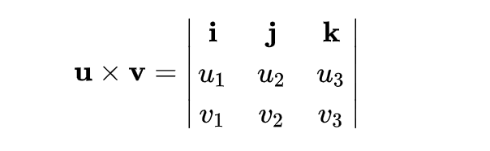
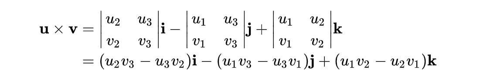
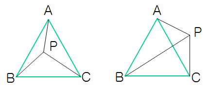
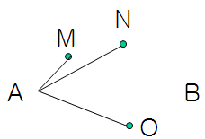

# 数学理论相关

## 如何用向量和坐标系描述点和线段？

向量包含：

- 长度： `v.length = function(){return Math.hypot(this.x, this.y)};`（x、y 的平方和再开平方根）
- 方向：`v.dir = function() { return Math.atan2(this.y, this.x);}`（向量与 x 轴的夹角的弧度值，取值范围是 -π 到 π，正数表示在 x 轴上方，负数表示在 x 轴下方）

根据长度和方向的定义可推导出：

```
v.x = v.length * Math.cos(v.dir);
v.y = v.length * Math.sin(v.dir);
```

其它参考：[Math.atan2()](https://developer.mozilla.org/zh-CN/docs/Web/JavaScript/Reference/Global_Objects/Math/atan2)

## 可视化中需要掌握的向量乘法知识

> 参考：
>
> - [标量和向量的定义 - wiki](https://zh.wikipedia.org/wiki/%E6%A0%87%E9%87%8F)
> - [向量点乘（内积）和叉乘（外积、向量积）概念及几何意义解读 - CSDN](https://blog.csdn.net/dcrmg/article/details/52416832)

### 点乘

向量的点积：（值是数值）

- 几何意义：b 向量在 a 向量方向上的投影
- 物理意义：a 力作用于物体，产生 b 位移所做的功

公式：


### 叉乘

向量的 [叉积](https://zh.wikipedia.org/wiki/%E5%8F%89%E7%A7%AF)：（值是向量）

- 几何意义：在三维几何中，向量 a 和向量 b 的叉乘结果是一个向量，更为熟知的叫法是法向量，该向量垂直于 a 和 b 向量构成的平面（下图为右手坐标系中的向量积）


- 物理意义：力产生的力矩

矩阵表示：（使用 [行列式](https://zh.wikipedia.org/wiki/%E8%A1%8C%E5%88%97%E5%BC%8F)）



可展开为：



## 如何用向量和参数方程描述曲线？

> 使用参数方程描述曲线，不仅可以描述常见的圆、椭圆、抛物线、正余弦等曲线，还能描述更具有一般性的曲线（没有被数学公式预设好的曲线），比如贝塞尔曲线、Catmull–Rom 曲线等。

以圆为例，圆的参数方程为：


其中圆心坐标是 (x0,y0)，半径长度为 r，θ∈[0，2π)。

```js
const TAU_SEGMENTS = 60; // 整圆由60个线段组成
const TAU = Math.PI * 2; // 一个整圆的弧度
function arc(x0, y0, radius, startAng = 0, endAng = Math.PI * 2) {
  const ang = Math.min(TAU, endAng - startAng);
  const ret = ang === TAU ? [] : [[x0, y0]];
  // 构成图形的弧线的段数 = 图形弧度(ang) / 整圆弧度(2PI) * 整圆弧线段数(TAU_SEGMENTS)
  const segments = Math.round(TAU_SEGMENTS * ang / TAU);
  for(let i = 0; i <= segments; i++) {
    const x = x0 + radius * Math.cos(startAng + ang * i / segments);
    const y = y0 + radius * Math.sin(startAng + ang * i / segments);
    ret.push([x, y]);
  }
  return ret;
}

draw(arc(0, 0, 100)); // 在 (0,0) 点绘制一个半径为 100 的圆
```

## 使用三角剖分填充多边形以及判断点是否在多边形内部

1. 填充任意多边形：Canvas2D 先 ``draw()`` 再 ``ctx.fill()``；WebGL 使用成熟的库（[Earcut](https://github.com/mapbox/earcut)、[Tess2.js](https://github.com/memononen/tess2.js)、[cdt2d](https://github.com/mikolalysenko/cdt2d)）对多边形进行三角剖分，再通过 ``gl.drawElements()`` 方法就可以把图形显示出来。

2. 判断点是否在多边形内部：将图形进行三角剖分后，根据点与三角形的数学关系来判断点是否在某个三角形的内部或边上。

### 使用向量判断点是否在三角形内部或边上

已知一个三角形的三个顶点分别是A、B、C，平面上一点 P 连接三角形三个顶点的向量分别为 PA、PB、PC，那么 P 点在三角形内部的 [充分必要条件](https://zh.wikipedia.org/wiki/%E5%85%85%E5%88%86%E5%BF%85%E8%A6%81%E6%9D%A1%E4%BB%B6) 是：PA X PB、PB X PC、PC X PA 的符号相同。（TODO 这种方法我还不知道如何论证）



另一种比较复杂的判定方法：如果P在三角形ABC内部，则满足以下三个条件：P, A 在 BC 的同侧、P, B 在 AC 的同侧、P, C 在 AB 的同侧；某一个不满足则表示P不在三角形内部。（比如上面这个图右边的 P 点，P, B 在 AC 的两侧，因此 P 在三角形外）

参考1：[二维平面上判断点是否在三角形内的四种方法 - 博客园](https://www.cnblogs.com/tenosdoit/p/4024413.html)

参考2：如何判断两个点是否在某条直线的同一侧？



AB X AM 和 AB X AN 的方向都是垂直屏幕指向外，因此 M, N 在 AB 同侧。

## 如何用仿射变换对几何图形进行坐标变换？

[全篇](https://time.geekbang.org/column/article/259264) 都没看懂